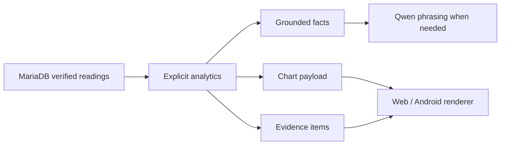

# Deterministic analytics, charts, and evidence

FarmPi's analytics are Python functions over catalogue-validated readings. They do not ask Qwen to write SQL, select a column, calculate a total, or choose a chart value. `app/measurements.py` is the central catalogue for fields, units, safe ranges, aliases, permitted operations, educational concepts, and chart suitability.

Supported operations include current values, extrema/rankings, minimum, maximum, average, rainfall total, change, range, simple first-to-last rate/trend, simple two-standard-deviation anomaly flagging, paddock comparisons, and compact summaries. Every historical request has an explicit period: last hour, last 24 hours, last seven days, or local `today`/`this morning` (Pacific/Auckland calendar boundaries converted to UTC before query).

`observed_at` is used only when the device clock is valid and within tolerance; otherwise analytics uses FarmPi `received_at`. This makes clock quality visible rather than silently mixing unreliable node times into trends.

## Chart API contract

`POST /api/ask` can return `chart` for comparison and historical questions. It contains `type` (`bar` or `line`), `title`, `x_label`, `y_label`, `unit`, `source_period`, `provenance`, and `series`. Each series has a name and verified `{x, y}` points. Clients render the payload; values never originate in a language model.

The same response includes bounded `evidence`: paddock, sensor UID where available, timestamp, value, and simulated flag. This is deliberately separate from fluent answer text so a learner can inspect how a result was produced.

## Screen, voice, and evidence

Current-value responses use human-readable freshness on screen (for example, `Updated 2 minutes ago` or `Last reading: 9:42 am`). Their evidence payload retains full `observed_at` and `received_at` values plus sensor and simulated provenance. The API also provides a concise `spoken_answer`; the native Android client uses it for normal TTS, so exact timestamps and routine simulated-data labels are available visually or through **Show evidence**, rather than adding avoidable spoken cognitive load. The built-in browser page is a diagnostic/fallback client and currently speaks the detailed `answer`.

Charts are deliberately modest: line/time views and bar/comparison views only. They are instructional aids, not a BI dashboard, forecast, or agronomic model.

