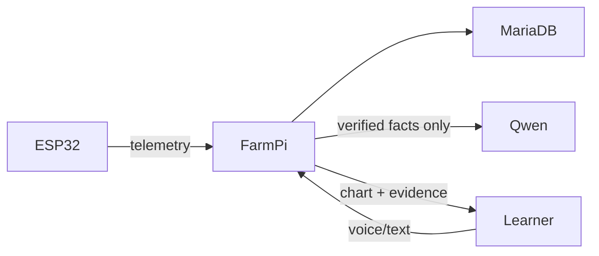

# FarmPi visual documentation

These Mermaid source files are the maintainable architecture diagrams for the capstone. Render them in a Mermaid-capable Markdown viewer or export SVG/PNG from the `.mmd` source when inserting a portable formal document. Exported images are intentionally not checked in until a formal document needs a fixed rendition; this prevents stale image copies from diverging from the implementation.

| Diagram | What it explains |
| --- | --- |
| [System architecture](system-architecture.mmd) | Pi/ESP32/clients/data/model flow |
| [Layer boundaries](layered-boundaries.mmd) | responsibility and Qwen limits |
| [Ingest and time sync](ingest-time-sync.mmd) | UTC/drift/idempotency protocol |
| [Ask/answer](ask-answer.mmd) | learner request to evidence response |
| [Grounding pipeline](grounding-pipeline.mmd) | observational versus educational grounding |
| [Database ERD](database-erd.mmd) | important persistent identities |
| [NZ simulation](nz-simulator.mmd) | weather/paddock/telemetry model |
| [Repository structure](repository-structure.mmd) | component ownership |
| [Android architecture](android-architecture.mmd) | native client and TLS boundary |
| [Flexible learning](flexible-learning.mmd) | teach-by-doing adaptation loop |
| [Graphing flow](graphing-flow.mmd) | verified analytics to client chart |
| [Rename audit](rename-audit.mmd) | confirmation/mutation boundary |

